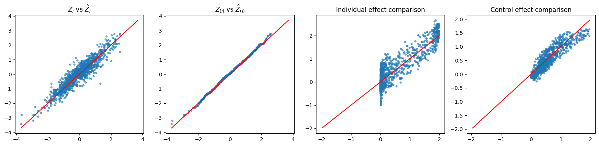

Extended Fiducial Inference for Individual Treatment Effects via Deep Neural Networks
===============

This code implements the Double Neural Network (Double-NN) method for individual treatment effect (ITE) estimation within the framework of Extended Fiducial Inference (EFI), developed by Sehwan Kim and Faming Liang. The method uses deep neural networks to model both treatment and control outcome functions, with an additional network for parameter estimation. Leveraging the EFI framework enables principled uncertainty quantification without requiring reference distributions. Numerical experiments show that the Double-NN method outperforms conformal quantile regression (CQR) in statistical inference for ITE.

## Related Publication

Sehwan Kim, and Faming Liang (2025+), [Extended Fiducial Inference for Individual Treatment Effects via Deep Neural Networks](https://arxiv.org/abs/2505.01995), accepted by *Statistics and Computing*

## Overview

The goal is to construct **prediction intervals** for the **treatment effect**:

$$
\text{ITE}(\mathbf{x}) = Y(1;\mathbf{x}) - Y(0;\mathbf{x})
$$

We assume the data-generating model:

$$
Y = c(\mathbf{x}) + T \cdot \tau(\mathbf{x}) + \sigma Z,
$$

where $c(\mathbf{x})$: baseline function, $\tau(\mathbf{x})$: treatment effect function, $\sigma$: noise scale and $Z \sim \mathcal{N}(0,1)$

These components are modeled using deep neural networks:

- The **c-network** models $c(\mathbf{x})$ with parameters $\boldsymbol{\theta}_c$
- The **$\tau$-network** models $\tau(\mathbf{x})$ with parameters $\boldsymbol{\theta}_\tau$
- The **inverse network** models the mapping $\boldsymbol{\theta} = g(y, T, \mathbf{x}, z)$ with parameters $\mathbf{w}_n$

Note. Although the method involves several neural networks, **only the parameters $\mathbf{w}_n$ of the inverse network are directly updated** via EFI framework. For EFI, please refer [Extended Fiducial Inference: Toward an Automated Process of Statistical Inference](https://arxiv.org/abs/2407.21622) and related [code](https://github.com/sehwankimstat/EFI). The parameters of the c- and $\tau$-networks are **derived** from $\mathbf{w}_n$ from $g(y, T, \mathbf{x}, z)$. 

## Constructing Prediction Intervals for ITE

For the $k$-th iteration of the EFI algorithm, a new set of parameters $\boldsymbol{\theta}^{(k)}$ is imputed from the inverse network, producing a different realization of the treatment effect.

Given a test set of size $n_{\text{test}}$, each subject falls into one of the following categories:

### 1. Case: Control Outcome Observed ( $i \in \mathcal{I}_c$ )

- Observed: $Y_i^{obs}(0)$ and $x_i$
- Simulate:

$$
\hat{Y}_i^{(k)}(1) = \hat{c}^{(k)}(\mathbf{x}_i) + \hat{\tau}^{(k)}(\mathbf{x}_i) + \hat{\sigma}^{(k)} Z^{(k,1)}, \quad Z^{(k,1)} \sim \mathcal{N}(0,1)
$$

- Compute prediction interval for:

$$
\hat{Y}_i(1)^{(k)} - Y_i^{obs}(0),\quad \text{for } k=1,\ldots,K 
$$

### 2. Case: Treatment Outcome Observed ( $i \in \mathcal{I}_t$ )

- Observed: \( Y_i^{obs}(1) \) and $x_i$
- Simulate:
  
$$
\hat{Y}_i^{(k)}(0) = \hat{c}^{(k)}(\mathbf{x}_i) + \hat{\sigma}^{(k)} Z^{(k,2)}, \quad Z^{(k,2)} \sim \mathcal{N}(0,1)
$$

- Compute prediction interval for:

$$
Y_i^{obs}(1) - \hat{Y}_i(0)^{(k)},\quad \text{for } k=1,\ldots,K 
$$

### 3. Case: Only Covariates Observed ( $i \in \mathcal{I}_m$ )

- Observed: Only $x_i$
- Simulate:
  
$$
\hat{Y}_i^{(k)}(1) - \hat{Y}_i^{(k)}(0) = \hat{\tau}^{(k)}(\mathbf{x}_i) + \sqrt{2} \hat{\sigma}^{(k)} Z^{(k,3)}, \quad Z^{(k,3)} \sim \mathcal{N}(0,1)
$$

- Compute prediction interval directly for:

$$
\hat{Y}_i^{(k)}(1) - \hat{Y}_i^{(k)}(0),\quad \text{for } k=1,\ldots,K 
$$

## Results

The notebook `DoubleNN_nonlinear_nonlinear.ipynb`.describes the application of Double NN to the nonlinear $c(\cdot)$ and nonlinear $\tau(\cdot). Please refer the further detail.

    

The above figure presents the results of EFI on Linear Regression: (left) a scatter plot of $\hat{z}_{i}$ (y-axis) versus $z_i$ (x-axis), (middle) a Q-Q plot of $\hat{z}_i$ and $z_i$, and (right) confidence intervals of $\beta_1$ produced by EFI and OLS.

The left panel shows that the imputed random error is quite similar to the true unknown random error. The middle panel demonstrates that the imputed random error exhibits similar distributional behavior to the true random errors. The right panel indicates that the inference from EFI is comparable to that of MLE, Bayes (with objective prior), and Generalized Fiducial Inference.

